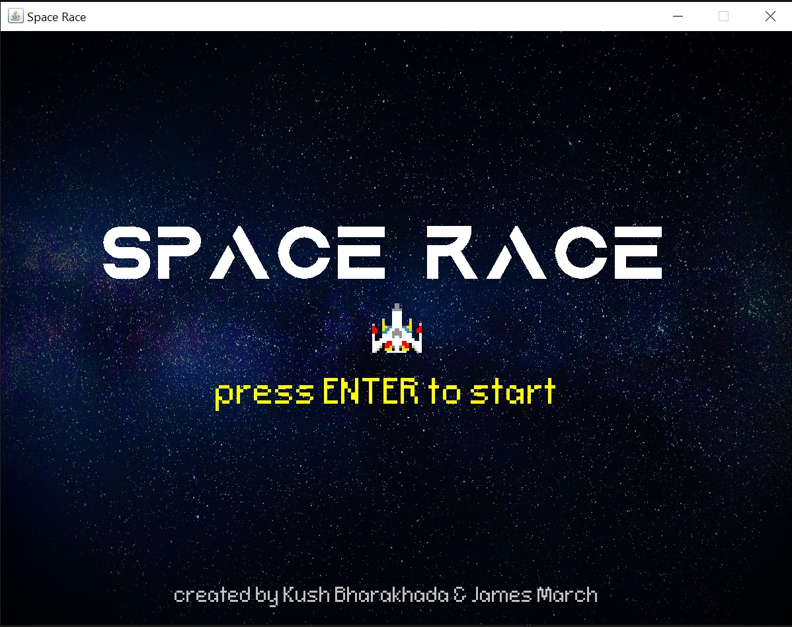
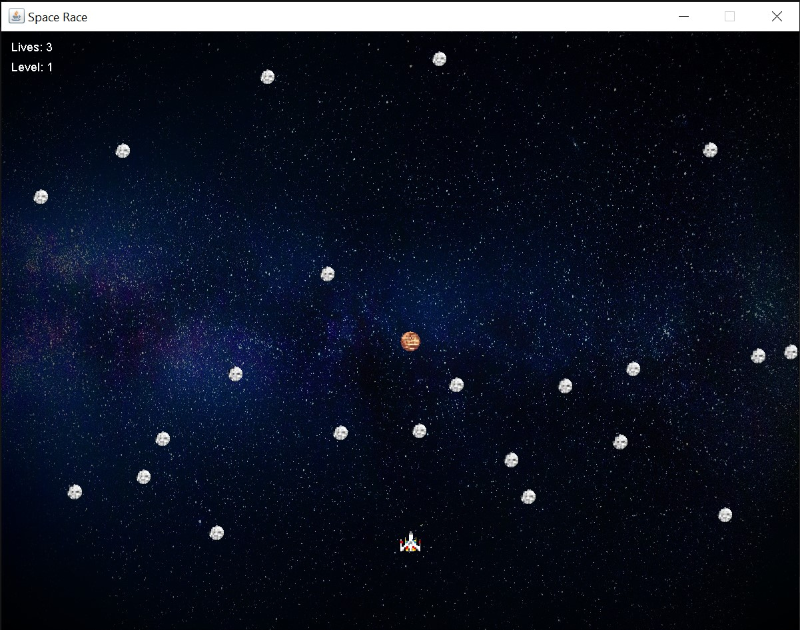
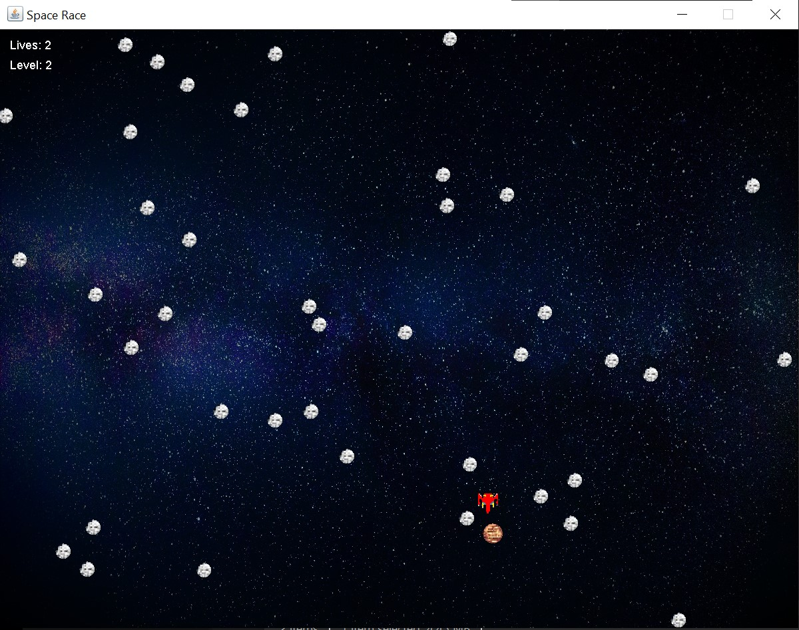
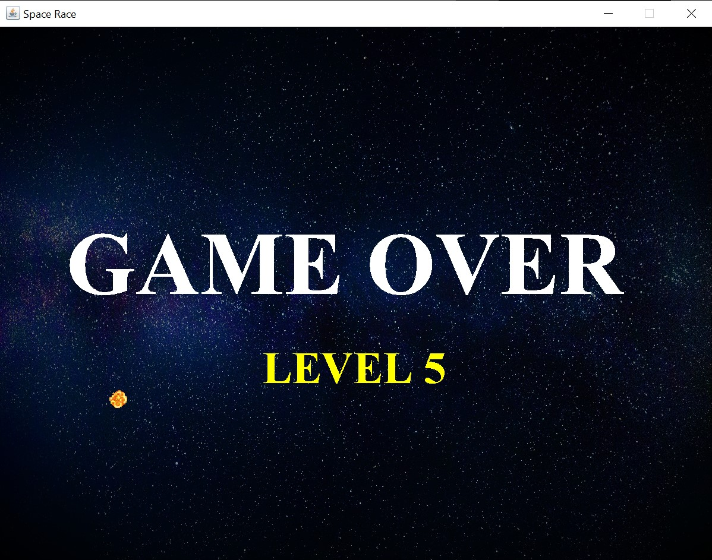

# Space Race
A simple game created by Kush Bharakhada and James March. Player must avoid asteroids and collect the target to level up. With each level, the speed of the asteroids increases, making it more difficult to get to the target.

## How to Play the Game
- Player must avoid the asteroids.
- Player starts with 3 lives.
- Player must touch the target to level up.
- Player must keep collecting the target and see what highest level they can get to.

## Start Screen
This screen is seen when the game is launched. Player must press ENTER to start the game.

## The Game
Avoiding the white/grey asteroids and getting to the orange/red target to level up. With each level, the speed of the asteroids increases.

A collision with an asteroid loses you a life and the spaceship turns red temporarily. During this moment, the player is invincible.

## Game Over
At the end of the game, the player is shown the level they reached.

